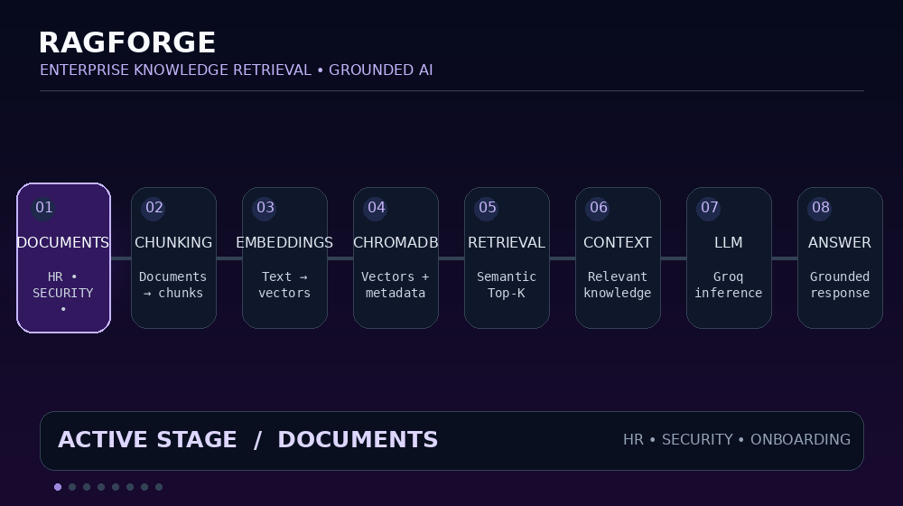

# ⚡ RAGForge

<p align="center">
  
</p>

<p align="center">
  <strong>Enterprise Knowledge Retrieval • Grounded AI</strong>
</p>

<p align="center">
  A hands-on Retrieval-Augmented Generation implementation built to understand how documents are chunked, stored, retrieved, and supplied as context to an LLM.
</p>

<p align="center">
  
  
  
  
  
</p>

---

## 🧠 What is RAGForge?

**RAGForge** is a learning-focused Retrieval-Augmented Generation (RAG) project that demonstrates how an LLM can answer questions using information retrieved from a custom knowledge base.

Instead of relying only on the model's internal knowledge, the system:

```text
User Question
      ↓
Semantic Retrieval
      ↓
Relevant Document Chunks
      ↓
Context Construction
      ↓
Groq LLM
      ↓
Grounded Answer

------------------------------------------------------------------------

## 🎯 What is RAGForge?

**RAGForge** is a learning-focused **Retrieval-Augmented Generation
(RAG)** project that builds a complete retrieval-to-generation pipeline
over a small enterprise-style knowledge base.

Instead of sending a question directly to an LLM, the project:

``` text
Question
   ↓
Retrieve relevant document chunks
   ↓
Build context
   ↓
Send context + question to LLM
   ↓
Generate a grounded answer
```

The goal is not to hide RAG behind a framework. The notebook exposes the
important stages directly so the retrieval process can be inspected and
experimented with.

------------------------------------------------------------------------

## ✨ The Project at a Glance

  Component           Current implementation
  ------------------- ------------------------------------------
  Language            Python
  Environment         Google Colab
  LLM API             Groq through an OpenAI-compatible client
  Model               `openai/gpt-oss-20b`
  Vector retrieval    ChromaDB
  Knowledge format    `.txt` documents
  Chunking            Paragraph-based
  Chunk metadata      Source name
  Retrieval           ChromaDB `query()`
  Retrieval control   Configurable `n_results`
  Generation          Context + question → LLM
  Grounding rule      Answer only from supplied context
  Temperature         `0.2`

------------------------------------------------------------------------

# 🧩 Architecture

The current implementation follows this pipeline:

``` text
┌──────────────────────┐
│ Enterprise Documents │
│                      │
│ HR Policy            │
│ Engineering Standards│
│ Onboarding Guide     │
│ Product Knowledge    │
│ Security Policy      │
└──────────┬───────────┘
           │
           ▼
┌──────────────────────┐
│   Document Loading   │
└──────────┬───────────┘
           │
           ▼
┌──────────────────────┐
│       Chunking       │
│  Paragraph → Chunk   │
└──────────┬───────────┘
           │
           ▼
┌──────────────────────┐
│      ChromaDB        │
│ Documents + Metadata │
└──────────┬───────────┘
           │
           │  User Question
           ▼
┌──────────────────────┐
│   Semantic Retrieval │
│       Top-K           │
└──────────┬───────────┘
           │
           ▼
┌──────────────────────┐
│   Retrieved Context  │
└──────────┬───────────┘
           │
           ▼
┌──────────────────────┐
│    Prompt Assembly   │
│ Context + Question   │
└──────────┬───────────┘
           │
           ▼
┌──────────────────────┐
│     Groq LLM         │
│  gpt-oss-20b         │
└──────────┬───────────┘
           │
           ▼
┌──────────────────────┐
│    Final Answer      │
└──────────────────────┘
```

The animated version of this flow is shown at the top of this README.

------------------------------------------------------------------------

# 📚 Knowledge Base

The notebook currently loads **5 enterprise-style text documents**:

``` text
company_hr_policy.txt
engineering_standards.txt
onboarding_guide.txt
product_knowledge_base.txt
security_policy.txt
```

They cover areas such as:

-   employee policies
-   engineering practices
-   employee onboarding
-   product information
-   security requirements

Using the notebook's current chunking function, these files produce
**120 usable chunks** in total.

### Chunk distribution

  Document                    Chunks
  ------------------------ ---------
  HR Policy                       25
  Engineering Standards           18
  Onboarding Guide                22
  Product Knowledge Base          33
  Security Policy                 22
  **Total**                  **120**

------------------------------------------------------------------------

# 🔬 How the RAG Pipeline Works

## 1. Install dependencies

The notebook starts with:

``` python
!pip3 install openai chromadb -q
```

The project intentionally keeps the dependency set small.

------------------------------------------------------------------------

## 2. Connect to Groq

The notebook uses Google's Colab secret storage to retrieve the API
credential:

``` python
from google.colab import userdata

api = userdata.get('Groq_apk')
```

Then it creates an OpenAI-compatible client pointed at Groq:

``` python
client = OpenAI(
    api_key=api,
    base_url="https://api.groq.com/openai/v1"
)
```

This keeps the API key out of the source code.

------------------------------------------------------------------------

# 3. Baseline: Direct LLM Question

Before building the RAG pipeline, the notebook asks the LLM a question
directly:

``` text
What is Nova Tech Solutions company work policy regarding work from home?
```

This provides a simple baseline:

``` text
Question → LLM → Answer
```

RAGForge then builds the retrieval layer that changes the process into:

``` text
Question
   ↓
Knowledge Retrieval
   ↓
Context
   ↓
LLM
   ↓
Answer
```

This makes the notebook useful for understanding the difference between
direct generation and retrieval-augmented generation.

------------------------------------------------------------------------

# 4. Load the Documents

The five text files are loaded into Python:

``` python
with open("/content/company_hr_policy.txt", "r") as f:
    hr_document = f.read()
```

The same process is used for the other knowledge-base documents.

At this point:

``` text
TXT files
   ↓
Raw Python strings
```

------------------------------------------------------------------------

# 5. Chunk the Documents

The project uses a simple paragraph-based chunking function:

``` python
def chunk_documents(text, source_name):
    paragraphs = text.strip().split("\n\n")
    chunks = []

    for para in paragraphs:
        para = para.strip()

        if len(para) < 50:
            continue

        if para.startswith("====="):
            continue

        chunks.append({
            "text": para,
            "source": source_name
        })

    return chunks
```

### What it does

``` text
Document
   ↓
Split on blank lines
   ↓
Remove very small sections
   ↓
Ignore separator headings
   ↓
Store text + source
```

Each chunk has this structure:

``` python
{
    "text": "...",
    "source": "HR policy"
}
```

The source metadata is retained so the retrieval results can show where
each chunk came from.

------------------------------------------------------------------------

# 6. Combine the Chunks

Chunks from all five documents are combined:

``` python
all_chunks = (
    hr_chunks
    + engineering_standards_chunks
    + onboarding_guide_chunks
    + product_knowledge_base_chunks
    + security_policy_chunks
)
```

The notebook then checks the total number of chunks:

``` python
print(len(all_chunks))
```

Current dataset:

``` text
120 chunks
```

------------------------------------------------------------------------

# 7. Store the Knowledge in ChromaDB

The notebook creates a ChromaDB client and collection:

``` python
chroma_client = chromadb.Client()

collection = chroma_client.create_collection(
    name="company_docs1"
)
```

Then every chunk is added with:

-   document text
-   unique ID
-   source metadata

``` python
collection.add(
    documents=documents,
    ids=ids,
    metadatas=metadata
)
```

The conceptual structure is:

``` text
Chunk text
    +
Chunk ID
    +
Source metadata
    ↓
ChromaDB collection
```

### Important implementation detail

This notebook does **not** configure a separate embedding model
manually.

It passes text directly to ChromaDB and uses ChromaDB's collection/query
mechanism for the retrieval step.

That keeps the implementation simple and lets the project focus on
understanding the RAG flow before adding additional retrieval
components.

------------------------------------------------------------------------

# 8. Retrieve Relevant Chunks

The retrieval function is:

``` python
def retrieve(question, n_results):
    results = collection.query(
        query_texts=[question],
        n_results=n_results
    )

    return results["documents"][0], results["metadatas"][0]
```

For example:

``` python
chunks, sources = retrieve(
    "what is the work from home policy?",
    5
)
```

The value of `n_results` controls how many chunks are requested.

``` text
Question
   ↓
ChromaDB query
   ↓
Top-N relevant chunks
   ↓
Source metadata
```

------------------------------------------------------------------------

# 9. Inspect the Retrieved Information

The notebook prints the retrieved chunks and their sources:

``` text
------Chunks1----------
Sources: HR policy
text: ...

------Chunks2----------
Sources: HR policy
text: ...
```

This is useful because you can actually see what information is being
passed to the generation stage.

That makes the pipeline easier to debug than a black-box chatbot.

------------------------------------------------------------------------

# 10. Build the Context

The retrieved chunks are combined:

``` python
context = "\n\n".join(chunks)
```

Conceptually:

``` text
Chunk 1
   +
Chunk 2
   +
Chunk 3
   ↓
Context
```

The context is then placed into the user message together with the
original question.

------------------------------------------------------------------------

# 11. Ground the LLM Response

The system prompt instructs the model to:

``` text
answer based ONLY on the provided context
```

It also tells the model to say that it does not have enough information
when the supplied context is insufficient.

The intended behavior is:

``` text
Context contains answer
        ↓
    Generate answer

Context does not contain enough information
        ↓
    Say information is insufficient
```

The prompt also asks the model not to make up information and to remain
concise.

This is the main grounding mechanism currently implemented in the
project.

------------------------------------------------------------------------

# 12. Generate the Final Answer

The notebook sends the constructed messages to:

``` python
model="openai/gpt-oss-20b"
```

with:

``` python
temperature=0.2
```

The final response is extracted using:

``` python
answer = response.choices[0].message.content
```

So the complete generation flow is:

``` text
Retrieved chunks
      ↓
    Context
      +
   Question
      ↓
   Prompt
      ↓
  gpt-oss-20b
      ↓
 Final answer
```

------------------------------------------------------------------------

# 🧪 Example Flow

### Question

``` text
What is the work from home policy?
```

### Retrieval

``` text
User Question
      ↓
ChromaDB
      ↓
Relevant HR chunks
      ↓
Top 3 / Top 5 chunks
```

### Context

``` text
Retrieved HR policy information
```

### Generation

``` text
Context + Question
        ↓
    Groq LLM
        ↓
   Final Answer
```

The notebook exposes the retrieved sources and chunks before displaying
the final answer.

------------------------------------------------------------------------

# 💡 Why This Project Is Useful

RAGForge focuses on the parts of RAG that are easy to hide when using a
high-level framework.

You can directly see:

### 📄 Data preparation

How raw documents become chunks.

### 🧩 Chunk representation

How each chunk contains both text and source information.

### 🗃️ Retrieval storage

How chunks are placed into a ChromaDB collection.

### 🔎 Retrieval

How a natural-language question is used to retrieve relevant chunks.

### 🧠 Context construction

How multiple retrieved chunks become the context for generation.

### 🤖 Generation

How an LLM uses the retrieved context to produce the answer.

### 🛡️ Grounding behavior

How the system prompt constrains the LLM to the supplied context.

------------------------------------------------------------------------

# 🔥 What Is Actually Implemented?

This repository currently implements:

``` text
✅ Direct LLM baseline
✅ Document ingestion
✅ 5-document knowledge base
✅ Paragraph-based chunking
✅ Source metadata
✅ ChromaDB collection
✅ Document IDs
✅ Retrieval using ChromaDB query
✅ Configurable Top-N retrieval
✅ Retrieved-chunk inspection
✅ Context construction
✅ Context + question prompting
✅ Groq LLM integration
✅ gpt-oss-20b generation
✅ Low-temperature generation
✅ Grounding-oriented system prompt
✅ RAG pipeline test
```

------------------------------------------------------------------------

# 🚫 What Is NOT Implemented Yet?

To keep the project description accurate, the current notebook does
**not** implement:

``` text
❌ BM25
❌ Hybrid search
❌ Reranking
❌ Query rewriting
❌ Multi-query retrieval
❌ Parent-child retrieval
❌ Context compression
❌ RAG evaluation metrics
❌ Automated evaluation dataset
❌ FastAPI backend
❌ Web UI
❌ Authentication
❌ Production monitoring
❌ Agentic RAG
❌ Graph RAG
❌ Persistent ChromaDB configuration
```

These should be treated as future extensions, not current features.

------------------------------------------------------------------------

# 🛣️ Learning Roadmap

RAGForge can evolve in stages without replacing the current foundation.

``` text
CURRENT
   │
   ▼
Basic RAG
   │
   ├── Better chunking
   ├── Retrieval experiments
   └── Metadata experiments
   │
   ▼
Retrieval Engineering
   │
   ├── BM25
   ├── Hybrid retrieval
   └── Reranking
   │
   ▼
Advanced RAG
   │
   ├── Query transformation
   ├── Multi-query
   └── Context optimization
   │
   ▼
RAG Evaluation
   │
   ├── Retrieval metrics
   ├── Answer quality
   └── Failure analysis
```

The roadmap is deliberately separated from the current implementation so
the repository remains technically accurate.

------------------------------------------------------------------------

# 📁 Current Repository

The project currently centers around the notebook:

``` text
ragforge-enterprise-rag/
│
├── assets/
│   └── ragforge-pro-github.gif
│
├── RAG (1).ipynb
├── README.md
└── .gitignore
```

The knowledge-base `.txt` files can also be included in the repository
when they are intended as public demo data.

------------------------------------------------------------------------

# ⚙️ Run the Project

## Google Colab

The notebook is designed for **Google Colab**.

### 1. Open

``` text
RAG (1).ipynb
```

### 2. Install dependencies

The first cell installs:

``` bash
pip install openai chromadb
```

### 3. Add the Groq credential

The notebook expects a Colab secret named:

``` text
Groq_apk
```

### 4. Make the text documents available

The notebook expects the files under:

``` text
/content/
```

### 5. Run the notebook from top to bottom

The intended sequence is:

``` text
Install
  ↓
Groq connection
  ↓
Direct LLM test
  ↓
Load documents
  ↓
Chunk documents
  ↓
Create ChromaDB collection
  ↓
Store chunks
  ↓
Retrieve chunks
  ↓
Ask RAG
  ↓
Test pipeline
```

------------------------------------------------------------------------

# 🔐 Security

**Never commit API keys to GitHub.**

The notebook retrieves the Groq credential through Colab's secret
mechanism rather than hardcoding the key.

For this repository, keep secrets and local generated data out of Git:

``` gitignore
.env
*.env
venv/
.venv/
__pycache__/
*.pyc
.ipynb_checkpoints/
chroma_db/
```

If the included enterprise-style documents are fictional learning data,
they can be published as demo material. Do not publish real confidential
company documents, credentials, customer information, or proprietary
data.

------------------------------------------------------------------------

# 🧠 Project Philosophy

> **Build the RAG pipeline before hiding it behind a framework.**

RAGForge is intentionally implemented with a small number of moving
parts.

The purpose is to understand the actual flow:

``` text
Data
 ↓
Chunks
 ↓
Retrieval
 ↓
Context
 ↓
LLM
 ↓
Answer
```

Once that flow is understood, more sophisticated retrieval and
orchestration techniques can be added and evaluated against the
baseline.

------------------------------------------------------------------------

# 📌 Project Status

``` text
┌─────────────────────────────────────┐
│          RAGForge Status             │
├─────────────────────────────────────┤
│ Document ingestion          ████████ │
│ Chunking                    ████████ │
│ ChromaDB retrieval          ████████ │
│ Context construction        ████████ │
│ LLM generation              ████████ │
│ Grounding prompt            ████████ │
│ Advanced retrieval          ░░░░░░░░ │
│ Evaluation                  ░░░░░░░░ │
│ Productionization           ░░░░░░░░ │
└─────────────────────────────────────┘
```

**Current stage: Working foundational RAG prototype.**

------------------------------------------------------------------------

# 👨‍💻 Author

**Prathik Chandra**

Computer Science Engineering

Focus areas:

`AI/ML` · `RAG` · `LLMs` · `Agentic AI` · `Backend Development`

------------------------------------------------------------------------

```{=html}
<p align="center">
```
`<strong>`{=html}⚡ RAGForge`</strong>`{=html}
```{=html}
</p>
```
```{=html}
<p align="center">
```
`<em>`{=html}Retrieve the knowledge. Build the context. Generate the
answer.`</em>`{=html}
```{=html}
</p>
```
```{=html}
<p align="center">
```
⭐ If you're learning RAG, explore the notebook and experiment with the
retrieval pipeline.
```{=html}
</p>
```
